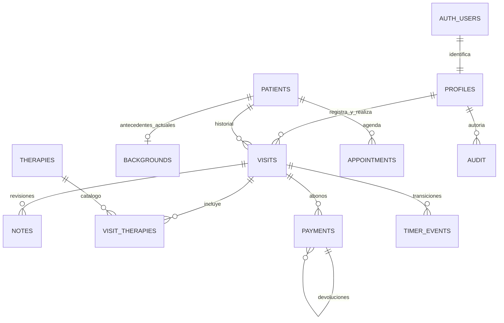

# Modelo de datos

| Tabla | Finalidad / integridad |
|---|---|
| profiles | UUID de Auth, nombre, activo y permisos; no se eliminan autores anteriores |
| patients | Documento textual normalizado y único por tipo, contacto, preferencias y consentimientos separados; versión e índices |
| backgrounds | Antecedentes generales, actualizador/fecha/versión; RLS clínico |
| visits | Paciente, atención, registrador, terapeuta, estado, duración, copia de tarifa/precio; versión |
| notes | Motivo, síntomas, nota, respuesta, revisión única por visita, autor/fecha/motivo de corrección; inmutables y RLS clínico |
| therapies / visit_therapies | Catálogo activo y copias del nombre aplicado; una visita puede tener varias técnicas |
| rates | Dos tarifas fijas: Tarifa 1 (30 min) y Tarifa 2 (60 min), un monto independiente por tarifa; cada visita guarda sus propios minutos y monto |
| payments | Pagos confirmados/pendientes, método, receptor copiado, referencia, autor y confirmador; UUID único de reintento; devolución enlazada |
| sinpe_numbers | Receptores configurables y estado activo, sin integración bancaria automática |
| timer_events | Inicio/pausa/continuación/finalización/cancelación/alarma atendida con actor y hora |
| appointments | Fecha/hora, duración, terapeuta y estado; control de versión y superposición |
| templates | Texto clínico editable, accesible solo con permiso clínico |
| settings | Identidad visual del centro, sin asignación supuesta de tarifas |
| audit | Tabla/ID/acción/actor/hora, nunca cuerpo de nota clínica |
| import_batches | Procedencia, conteo, autor/fecha y clave de lote; importación atómica |

`timestamptz` guarda instantes; presentación y límites diarios usan America/Costa_Rica (UTC−06:00). El temporizador acumula segmentos activos y guarda el segmento actual/inicio/fin previsto. Cuenta atrás cero no cambia estado financiero ni precio. La prolongación registra el tiempo real al finalizar.

`workspace_snapshot` es SECURITY INVOKER, usa RLS y una consulta estable, y devuelve información coherente para los indicadores. Las RPC de escritura son SECURITY DEFINER con `search_path` fijo, validan permisos activos, usan transacciones y bloqueo por visita. No se confía en claims editables de metadata para permisos.

No se conceden escrituras directas sobre pagos, notas, terapias de visita, temporizadores o auditoría. No hay vistas que eviten RLS ni archivos expuestos. La única clave privilegiada se usa en la función de servidor de invitación. La baja de usuarios es lógica; los UUID históricos se conservan.

Límites deliberados: una instancia equivale a un centro (sin multiempresa); no hay diagnósticos automáticos, factura electrónica, conciliación bancaria, archivos clínicos ni mensajería. La carga actual lee el conjunto permitido en memoria: al crecer el historial debe paginarse el expediente y trasladar agregaciones a RPC específicas, conservando el snapshot consistente.
